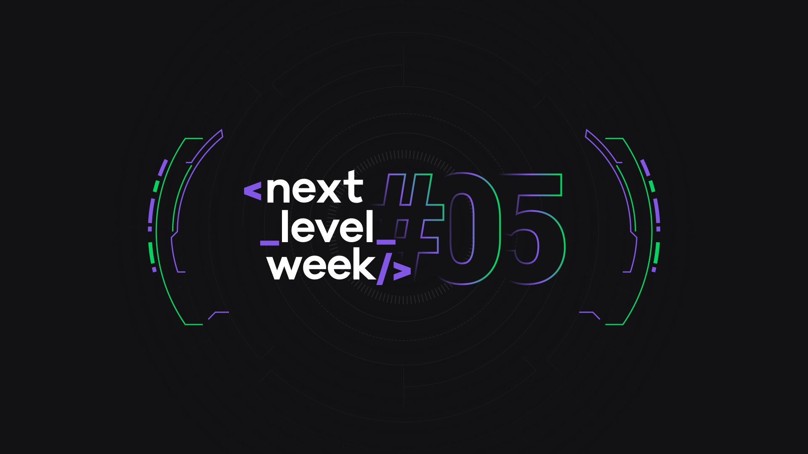
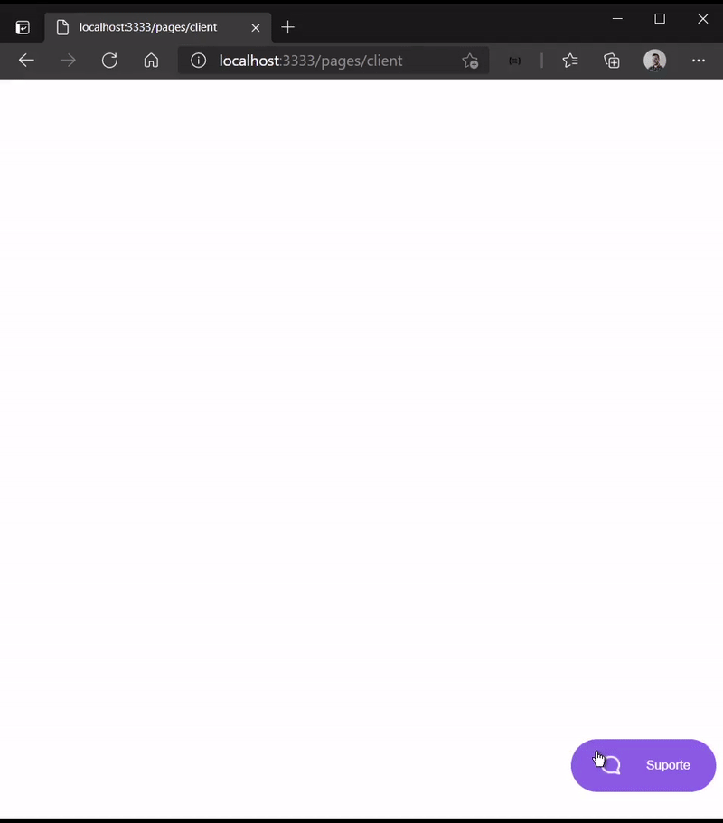
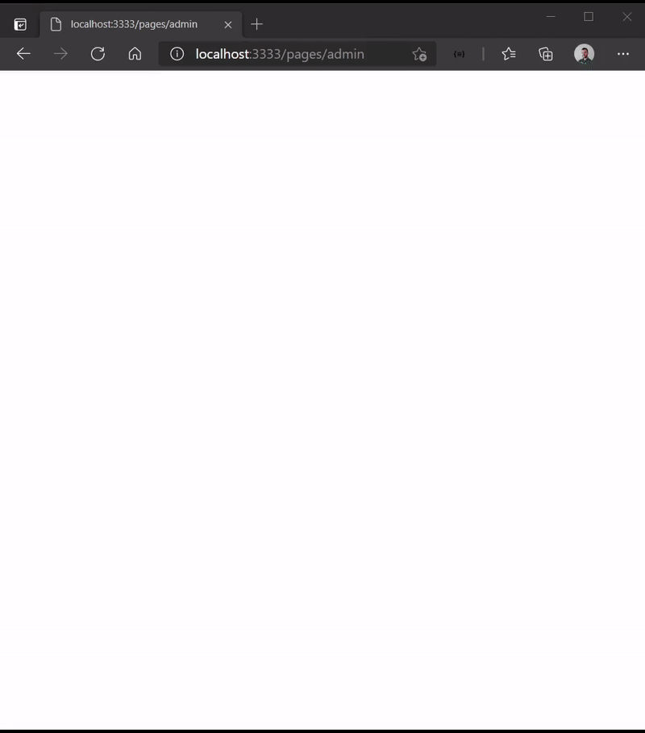

# Chat Widget :speech_balloon:



<p align="center">Este projeto foi desenvolvido durante a Next Level Week (NLW#05) promovida pela Rocketseat.</p>

<p align="center">
  <a href="#about">Sobre</a>&nbsp;&nbsp;&nbsp;|&nbsp;&nbsp;&nbsp;
  <a href="#technologies">Tecnologias</a>&nbsp;&nbsp;&nbsp;|&nbsp;&nbsp;&nbsp;
  <a href="#preview">Visualização</a>&nbsp;&nbsp;&nbsp;|&nbsp;&nbsp;&nbsp;
  <a href="#requires">Requisitos</a>&nbsp;&nbsp;&nbsp;|&nbsp;&nbsp;&nbsp;
  <a href="#install">Instalação</a>
</p>

## Sobre <a name="about"></a>

> Trata-se de um canal de atendimento em tempo real entre cliente e suporte utilizando protocolo websocket e API REST.

<br>

## Tecnologias :heavy_check_mark:<a name="technologies"></a>
- [Socket.IO](https://socket.io)
- [SQLite](https://www.npmjs.com/package/sqlite3)
- [Express](https://expressjs.com/pt-br/)
- [TypeORM](https://typeorm.io/#/)
- [TypeScript](https://www.typescriptlang.org/)

## Visualização <a name="preview"></a>

<br />
<table>
  <tr>
    <th>Painel Cliente</th>
    <th>Painel Atendente</th>
  </tr>
  <tr>
    <td></td></td>
    <td></td></td>
  </tr>
</table>

## Requisitos :warning:<a name="requires"></a>

* [node V14.16](https://nodejs.org/pt-br/download/)
* [yarn v3.0](https://classic.yarnpkg.com/en/docs/install/#windows-stable)

## Instalação <a name="install"></a>

```bash
# Instalar todas as dependências necessárias:
$ yarn ou yarn install

# Iniciar migrations:
$ yarn typeorm migration:run

# Iniciar o projeto em localhost:
$ yarn dev
```
## To do

* [ ] Permitir finalização do chamado
* [ ] Incluir botão para minimizar o chat
* [ ] Emitir um alerta ao receber novas mensagens